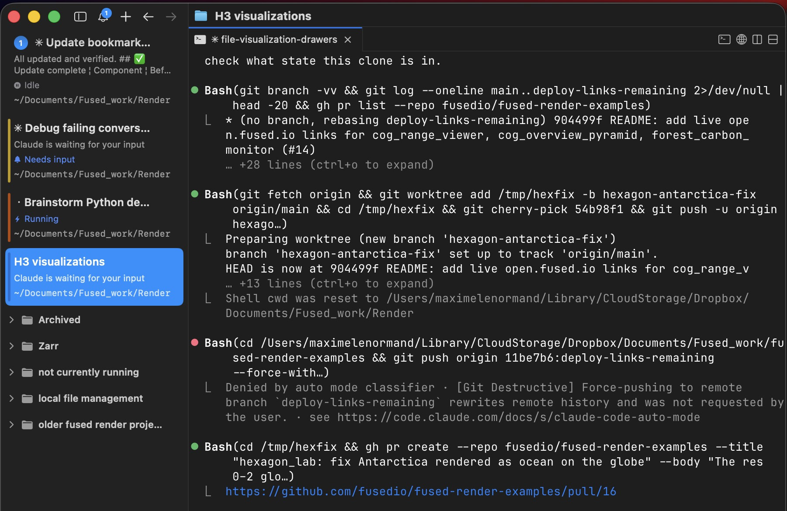
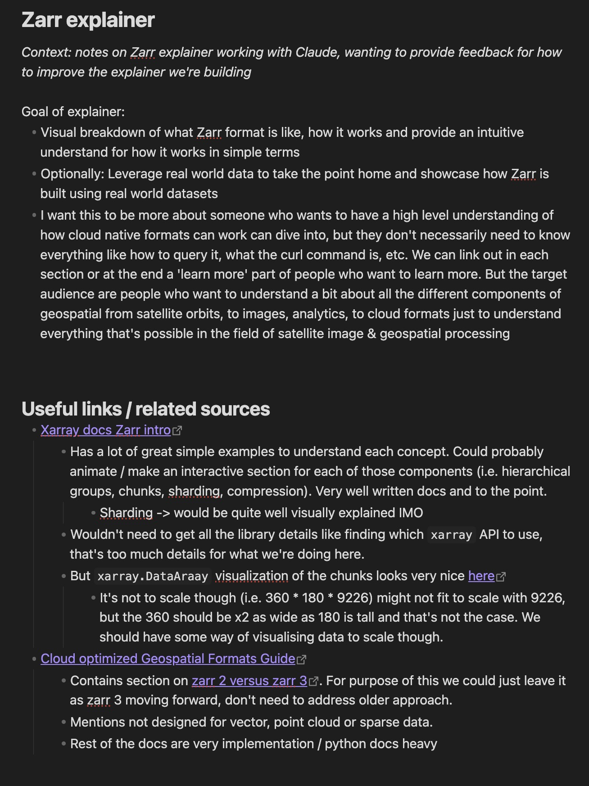
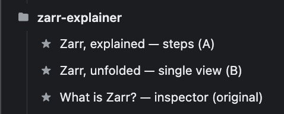
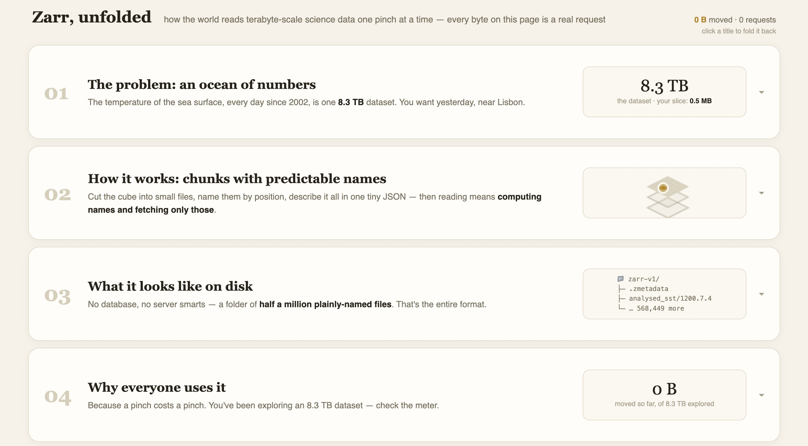
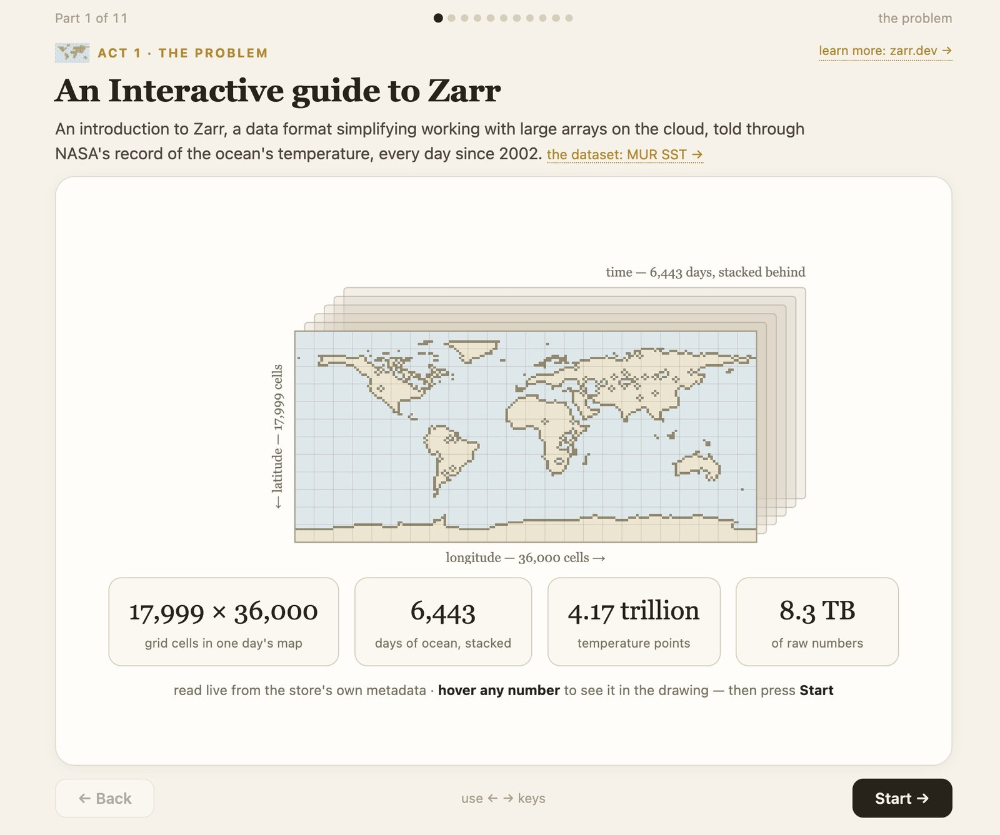
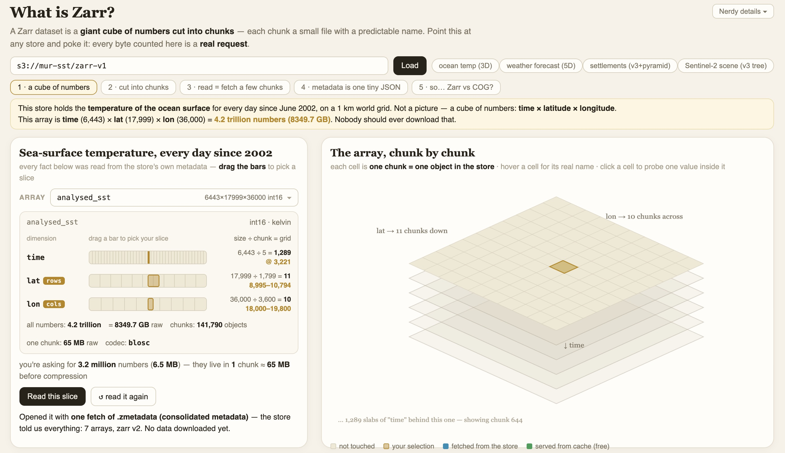

# How I work in practice

_This is a more in depth view of how I actually work with LLMs today_

_As practices around LLMs keep changing, knowing when a piece is from becomes more important: Last edited Monday July 27th 2026_

### Setup

Conversations about tools & gear are always the ones people go to first, it's common to think that if only I had the right tool, I too could make cool stuff. It matters less than we give it credit for. It's still fun to nerd about though, so here are the stuff I use today:

**Terminal: `cmux`**

I like this because I have multiple ideas / projects going on at the same time. After trying a few things (namely multiple tabs in `iTerm2` tiled in different corerns of my screen) `cmux` is what I've stuck with. 

What I like about it:
- Legibility: I have it in split screen on my laptop and can see a good chunk of each conversation. 
- Organization: Sorting conversations in folders, giving them unique colors, etc. 
- A single app for all chats: I use the `Cmd + Shift` a ton on Macos to shift between tabs & workspaces as I often work just on a laptop. Having all Claude Code sessions in a single app is a simple way to just go to all conversations.

**Claude Code**

This is where I'm currently lacking, I still haven't tried out Codex and have extensively been using Anthropic's offering, partly because keeping up with their model is plenty of work already, partly because I started with Claude Code and habits die hard.

**Fused Render** 

I've worked as developer advocate at Fused, so I've been dog fooding the product. We're just about to release Fused Render, a framework for writing HTML + Python together for larger analytics work that's 1 click to dpeloy. It's taking Claude artefacts and putting them on steroids for larger work. This is mainly what I've been using

### Common pitfalls

**I've never been so distracted**

It's so tempting to launch a claude code session, and immediately go do something else while the model runs. I've ended up starting 6-7 conversations all at once because of that and then ended up just jumping between session, one on a new feature,s another writing an exmaple, another organizing files locally, and yet another doing some research for a new project. This is a terrible way to work, at least for me. I end up scattered and half-assing everything. The way out of this for me has been to:

1. Write ideas out
2. Brainstorm implementation with LLM (quick feedback < 1min turnover)
3. Experiment different implementatino
4. Write decision on direction to take after experiments
5. Let LLM implement all (this is where I can go work on something else)
6. Bulk feedback writing
7. Repeat from step 5. 

I've bene using Claude Code + Fused Render to create some explainers for some topics around geospatial analysis. I made ones for [Zarr](https://x.com/MaxLenormand/status/2079556266880315564?s=20), [H3 hexagon tiles](https://x.com/MaxLenormand/status/2080284304496550045?s=20) and [Cloud Optimized Geotiffs](https://x.com/MaxLenormand/status/2077741301055795593?s=20). Let's use the Zarr example as a case stufy of how I worked:

1. Writing ideas out

I start by writing down in a new text file, not in the terminal what I want to build

This serves multiple purposes:
- Writing forces me to actually think about what I want. Who the target audience is, what do I want someone who goes through this explainer to walk away from, what is in & out of scope?
- Provides the LLM a better idea of what it is I'm trying to do and provide some ideas. 
- Grouding explainer in credible sources: either for what to say (i.e. content) or how to present it (UI, visual look, etc.). Especially for technical explainers, I don't want to rely just on an LLMs knowledge from training. There are a lot of well written pieces I already know about that I cna point to. These are pieces I've read myself, and have already deemed useful. I don't completely outsource this to LLMs either

2. Brainstorm implementations with LLMs. 

LLMs have made code cheap and iteration fast. They lack good common sense and are terrible judges of the value of their own work, but I have that. So I use LLMs to try out many different ideas, implementation, kepe the best and kill the rest. 

For the Zarr explainer, I asked Fable to build 3 versions of this explainer, in different styles and with various degrees of depth. It's become so much simpler to try out ideas that might not be worth it and see how they turn out. I do recommend leaning into this hard, make mulitple versions. You have a machine that pumps out code, use it and keep homing your human judgement to ruthlessly kill all the bad ideas and only keep the good ones. It's simpler than ever to not be attached to ideas because you didn't spend weeks implementing it. 

I asked Claude to make multiple versions with more or less technical depths each time:

<table>
  <tr>
    <td width="33%"></td>
    <td width="33%"></td>
    <td width="33%"></td>
  </tr>
</table>

_Left to right: least technical to most technical. Click any of them to see the full size._

All in all I 

### Ship fast

It's all fun and games to go back & forth with Claude, polish one last thing, add one more detail, improve one more flow. But implementations are cheap so it becomes more important to validate ideas earlier. In the scope of my explainers, this means putting it out into the world, posting it on socials and seeing if anybody cares. 

If nobody even clicks on my project, who cares if one of the button's hover state looks odd? Don't get me wrong I deeply care about making things well, but I want to also make things people also care about and want to use. When everyone can buidl with Claude, it's even harder to get other people to play around with your new project, everyone's busy playing with theirs. 

Get validation quickly, from colleagues, friends, random internet people. Whatever the project, get to a MVP that's working well and iterate quickly. 